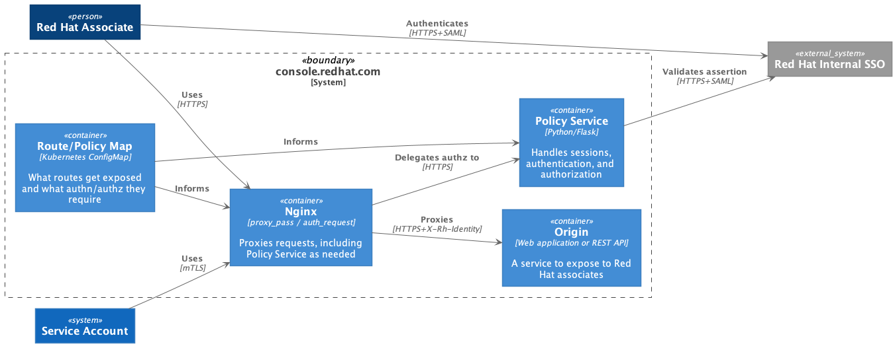
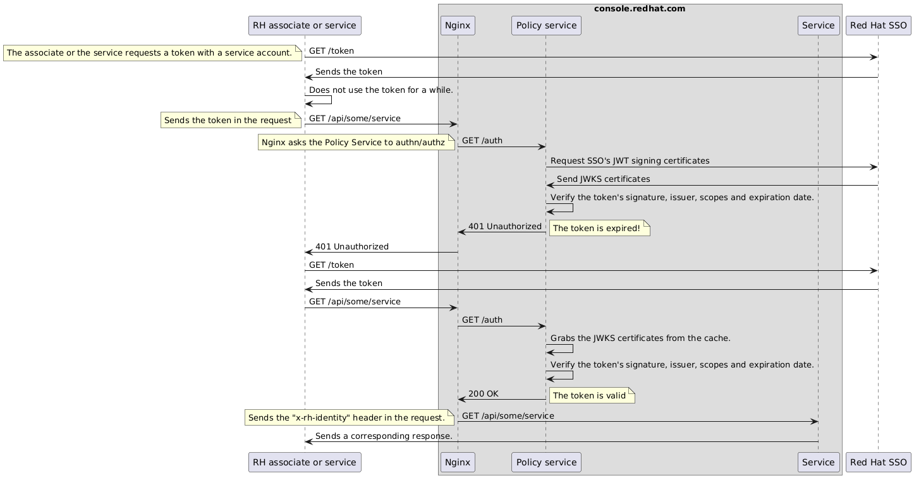

# Turnpike

This is an internal gateway used to authenticate Red Hat associates against internal
Red Hat SSO or mTLS, along with an auth/policy service to handle SAML authentication and
provide ACL-based authorization.

## Architecture

Turnpike makes use of the [auth_request][auth_request] feature of Nginx, which delegates authentication/authorization
to a web service. The web service itself is a [Flask][flask] application that implements a SAML Service Provider and
allows/denies specific requests to routed web applications & APIs based on the attributes of the SAML assertion. Session
data is stored in Redis to better manage content and expiry.



A successful SAML user request workflow looks like:


A successful mTLS request workflow looks like:


A successful OIDC service account request flow looks like:


Note: TLS can be terminated either with Nginx itself, or with a standalone service in front of Nginx. The diagram's
"mTLS Gateway" refers to whatever service terminates TLS. Also, the expected subject and issuer header names can be
adjusted by setting `HEADER_CERTAUTH_SUBJECT` and `HEADER_CERTAUTH_ISSUER` variables.


## Developer environment setup

You can use `scripts/setup_devel_env` to configure the certs and configure to use the samltest.id IdP. Once the app is
running, you will need to visit https://samltest.id/upload.php and upload https://turnpike.example.com/saml/metadata.xml
before the IdP will recognize your turnpike instance. The SP entityId includes a uuid so that you don't accidentally
overwrite another developer's SP XML.

If you want to configure manually or understand what the script does, read on.

### Nginx Configuration

In `services/nginx`, create the following files:

1. `certs/cert.pem` - The PEM encoded certificate for Nginx (can be the same as the web cert)
2. `certs/key.pem` - The PEM encoded certificate for Nginx (can be the same as the web key)
3. `certs/ca.pem` - The PEM encoded trust chain to verify client certificates

### SAML Service Provider Configuration

The implementation of a SAML service provider uses the OneLogin [python3-saml][python3-saml] library.

As with any SAML SP configuration, you will need:

1. An SSL certificate and key for your Turnpike gateway
2. The SSL certificate for your SAML Identity Provider (IdP)
3. The configuration of your Identity Provider as exposed by their IdP metadata endpoint.

Then in your copy of the Turnpike code, in `/saml` create the following files:

1. `settings.json`- The metadata settings for the IdP and SP (an [example][settings-example])
2. `advanced_settings.json` - Advanced SAML settings for the IdP and SP (an [example][adv-settings-example])

You can fill out the latter two by finding corresponding fields in your IdP's metadata file and with collaboration with
their staff. For the Service Provider urls, you should use the following paths relative to your Turnpike hostname:

* Entity ID/metadata URL: `/saml/metadata.xml`
* ACS: `/saml/acs/`
* SLS: `/saml/sls/`

If you're looking to simply demo Turnpike or aren't ready to integrate with your real IdP yet, you can use the free
SAML test integration services available at https://samltest.id

You will also need to generate a TLS certificate for the hostname you're going to use to access your running development
environment. In `/nginx/certs`, name the certificate as `cert.pem` and the private key as `key.pem`.

If you are deploying Turnpike in Kubernetes or OpenShift, you should mount these configuration files using a
combination of ConfigMap and Secret resources mounted into your running pods.

### Running Using Docker Compose

The simplest way to run Turnpike locally is using Docker Compose.

First, you need to set proper environment variables. Copy the `.env.example` file to `.env`, copy the
`dev-config.py.example` to `dev-config.py`,  and customize them both as needed. You'll
need to generate a secret key for session security and you'll need to set the `SERVER_NAME` to the hostname you're
using for your SAML Service Provider, the same as the subject in your SP certificate.

Then, from the root of your copy of Turnpike, simply run:

    docker-compose build
    docker-compose up

If the subject of the SP certificate does not resolve to your local machine, you may have to add a mapping in your
`/etc/hosts` file. For example, if you issued your SP certificate to `cn=turnpike.example.com`, then you may need to add
to your `/etc/hosts` file a line:

    127.0.0.1  turnpike.example.com

Then, go to https://turnpike.example.com/api/turnpike/identity in your browser. You should immediately be redirected to
your configured IdP's login page, or if you're already logged into your IdP, a page that outputs the content of your
IdP's SAML assertion.

## Customizing and Extending Turnpike

### Route Map and Attribute Based Access Control

Turnpike expects that in the Flask container it will be able to find its route map and access control list at
`/etc/turnpike/backends.yml`. You can override it in app-interface. For Docker Compose, the file in your copy of Turnpike `dev-backends.yml` is mounted into
the Flask container at this path:

    - name: turnpike
      route: /api/turnpike
      origin: http://web:5000/api/turnpike
      auth:
        saml: "True"
    - name: healthcheck
      route: /_healthcheck
      origin: http://web:5000/_healthcheck

The file is a list of routes. Each route has three required fields: a `name` which must be a unique string, a `route`
which represents a URL prefix substring to match for this route, and an `origin` which represents the URL to proxy to.
The substring matching of `route` and the rewriting to `origin` are the same as the Nginx location matching and rewrite
rules.

If a route has a key `auth`, then it will require authentication. *If the `auth` key is missing, the default is to forbid
access unless the route resides under `/public/`* [(see best practices)][route-best-practice]. The `auth` key's value should be a set of key/value
pairs representing supported authentication schemes and corresponding authorization rules. At this time, the only
supported authentication schemes are `saml`, `x509`.

The value associated with `saml` should be a Python expression that evaluates to `True` or `False`. The only variable
in the expression is a dictionary `user` which contains the SAML assertion for the requesting user. If the assertion
had multiple `AttributeValue`s for a single `Attribute`, then those values are represented as a list of values.

> Note: The Red Hat SSO SAML assertion will return LDAP roles which Turnpike makes available to your predicates via:
`user['Role']`. Production SSO will return your production LDAP groups, configured at https://rover.redhat.com/groups/ while
Stage and other non-prod environments will return groups configured at: https://rover.stage.redhat.com/groups/.
If you create a new role for cloud.dot purposes, it is a good idea to prefix it with ' crc-'.

So for example, if you wanted to limit access to a route to users who had the role `admin`, `auditor`, or `manager`,
your Python expression could be:

    set(['admin', 'auditor', 'manager']).intersection(set(user['roles']))

The evaluation would use set-logic to look for overlaps. If there were any overlaps, the predicate would evaluate to
`True`. If not, `False`.

`x509` also takes a Python expression which evaluates to `True` or `False`. It is passed a dictionary `x509` which
contains two attributes: `subject_dn` and `issuer_dn` which can be used to further restrict which certs can be used
(nginx already verifies the trust chain based on the configured CA file).

For example to restrict the endpoint to a certificate with the DN of `/CN=test`, you could use:

    x509['subject_dn'] == '/CN=test'

> Note: To check your certificate's subject and issuer, you can use `openssl x509 -in <cert> -noout -subject` and join the content with slash, e.g. 'O=rhds, OU=serviceaccounts, UID=nonprod-hcc-rbac' to '/O=rhds/OU=serviceaccounts/UID=nonprod-hcc-rbac'

If using TLS terminated at Nginx, note that CRL and/or OCSP support should be configured in `NGINX_SSL_CONFIG` as
needed.

### Writing your own plugins

Turnpike's policy service is based on passing a request through a series of plugins that
evaluate the request for conformity with the deployment policies. These plugins allow
for a great deal of customization and enhancement with minimal code changes.

The plugin chain is configurable in the Flask application using the `PLUGIN_CHAIN`
setting, which contains a list of Python references to classes that subclass the
`TurnpikePlugin` abstract base class.

The `turnpike.plugins.auth.AuthPlugin` has its own special type of sub-plugin that
implements the `TurnpikeAuthPlugin` abstract base class. By setting a separate list of
authentication methods as `AUTH_PLUGIN_CHAIN`, you can customize the way that your
deployment supports authenticating and authorizing requests.

See the docstrings on those classes for more details.

## Further reading

You can check out the [service documentation][docs] in the `docs/` folder for more info.
Such as how to access turnpike, acquire certs, etc.


## Testing
To run local unit tests:
```
$ pytest
```

For testing SAML functionality, when the Flask config has `TESTING` set to a value that
resolves to `True`, an additional endpoint exists at `/saml/mock/` which, if you `POST`
a JSON object representing the contents of the SAML assertion you want to test with,
will set the requestor's session to contain that assertion. The response will have a
`Set-Cookie` header for the session; simply present that as a `Cookie` header in
subsequent requests to use the stored session.

    $ curl -vk -H "Content-Type: application/json" -d '{"foo":"bar"}' https://turnpike.example.com/saml/mock/
    ... snip ...
    < HTTP/1.1 204 NO CONTENT
    < Server: nginx/1.14.1
    < Set-Cookie: session=b56b832d-8aaa-4c06-9e80-3b424f0fcab2; Domain=.turnpike.example.com; Expires=Thu, 24-Sep-2020 22:05:43 GMT; Secure; HttpOnly; Path=/
    <
    $ curl -k -H "Cookie: session=b56b832d-8aaa-4c06-9e80-3b424f0fcab2" https://turnpike.example.com/api/turnpike/identity/
    {"identity":{"associate":{"foo":"bar"},"auth_type":"saml-auth","type":"Associate"}}

This endpoint returns a 404 if `TESTING` is not enabled.

## Retrieving your SAML session
For SAML requests to your API outside of your browser via CURL for instance, you'll
need to supply the `session` cookie like so:

```
curl https://internal.console.redhat.com/api/turnpike/identity/ -b 'session=<SESSION_COOKIE_STRING>'
```

You can either retrieve this from the browser developer tools by looking for the
`session` cookie value, or by accessing `https://internal.console.redhat.com/api/turnpike/session/`
in the browser, and getting the value from the `session` key.

## Linting/pre-commit
Linting will run automatically with `black` in a pre-commit hook, but you'll need to run `pre-commit install` first.
You can also run it manually with `pre-commit run -a`.


[auth_request]: https://docs.nginx.com/nginx/admin-guide/security-controls/configuring-subrequest-authentication/
[flask]: https://flask.palletsprojects.com/en/1.1.x/
[python3-saml]: https://github.com/onelogin/python3-saml
[settings-example]: https://github.com/onelogin/python3-saml/blob/master/demo-flask/saml/settings.json
[adv-settings-example]: https://github.com/onelogin/python3-saml/blob/master/demo-flask/saml/advanced_settings.json
[docs]: https://github.com/RedHatInsights/turnpike/blob/master/docs/_index.md
[route-best-practice]: https://github.com/RedHatInsights/turnpike/blob/master/docs/_index.md#best-practices-when-creating-routes


## Konflux pipelines
We have three build pipelines that should run when a PR is being created or being pushed.
They are the turnpike-web, turnpike-nginx, and the turnpike-nginx-prometheus.

The turnpike-web-on-pull-request pipeline will have the unit tests included.

The turnpike web will also have a bonfire-tekton integration test included with it because turnpike-web tests our web application and our nginx is not necessary to test the ephemeral env.

We also have enterprise-contract pipelines that must pass as well.
